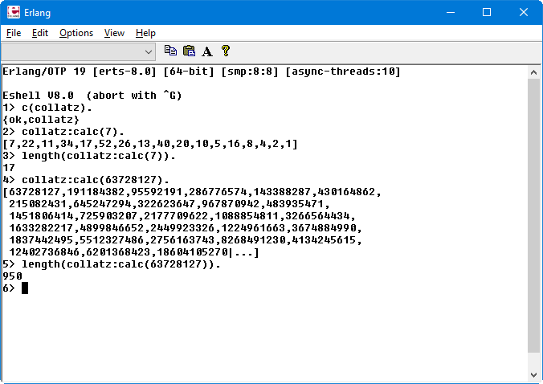

This code is inspired by the youtube video [UNCRACKABLE? The Collatz Conjecture - Numberphile](https://www.youtube.com/watch?v=5mFpVDpKX70).

Basically the Collatz Conjecture is a mathematical function that for any given number **n**, if **n** is **even** returns n/2 and if **n** is **odd** returns 3n+1. Let's call this function **C**(**n**).

The example presented in the video is the number 7.
```
 C(7) = 22;
C(22) = 11; 
C(11) = 34;
C(34) = 17;
C(34) = 17;
C(17) = 52;
C(52) = 26;
C(26) = 13;
C(13) = 40;
C(40) = 20;
C(20) = 10;
C(10) =  5;
 C(5) = 16;
C(16) =  8;
 C(8) =  4;
 C(4) =  2;
 C(2) =  1;
 C(1) =  4; % STOP: we already know C(4)
```

The output from this erlang module is:


For me the inspiration came when I saw that this Collatz function requires 949 steps to converge to the number 1, for the number 63.728.127:


So let's see how many steps my procedure determines:


The reason why it says 950 instead of 949 is that I am printing the original number as a step.

What about performance you say?

Well, we can use the function [timer:tc/3](http://erlang.org/doc/man/timer.html#tc-3) function to measure the execution time of our function. The result is astonishing :) 0 **micro**seconds:

