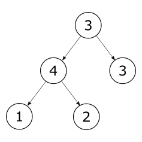
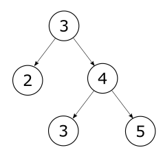

# Exercise 7-5: Binary Tree Records

Define a record type to represent _binary trees_ with numerical values held at internal nodes and at the leaves. `Figure 1` shows an example.

Define functions over the record type to do the following:

* Sum the values contained in the tree.
* Find the maximum value contained in the tree (if any).

**Figure 1**: An example of a binary tree

A tree is ordered if, for all nodes, the values in the left subtree below the node are smaller than or equal to the value held at the node, and this value is less than or equal to all the values in the right subtree below the node. `Figure 2` shows an example:

* Define a function to check whether a binary tree is ordered.
* Define a function to insert a value in an ordered tree so that the order is preserved.

**Figure 2**: An ordered binary tree