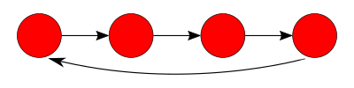

# Exercise 4-2: The Process Ring

Write a program that will create **N** processes connected in a ring, as shown in **Figure 1**. Once started, these processes will send **M** number of messages around the ring and then terminate gracefully when they receive a quit message. You can start the ring with the call `ring:start(M, N, Message)`.

<strong>Figure 1.</strong> The process ring

There are two basic strategies to tackling this exercise. The first one is to have a central process that sets up the ring and initiates sending the message. The second strategy consists of the new process spawning the next process in the ring. With this strategy, you have to find a method to connect the first process to the second process.

Regardless of the strategy you chose, make sure you have solved this exercise with pen and paper before you start coding. It differs from the ones you have solved before because you will have many processes executing the same function in the same module at the same time. Furthermore, processes will be using this function to interact with each other. When writing your program, make sure your code has many `io:format` statements in every loop iteration. This will give you a complete overview of what is happening (or not happening) and should help you solve the exercise.