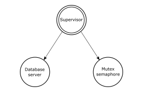

# Exercise 6-3: A Supervisor Process

The supervisor we provided in the example is very basic. We want to expand its features and allow it to handle more generic functionality. In an iterative test-and-develop cycle, add the following features one at a time:

* If a child terminates both normally and abnormally, the supervisor will receive the exit signal and restart the child. We want to extend the `{Module, Function, Argument}` child tuple to include a `Type` parameter, which can be set to `permanent` or `transient`. If the child is transient, it is not restarted if it terminated normally. Restart it only upon abnormal termination.

To test your supervisor, start the mutex semaphore and database server processes, as show in `Figure 1`.

**Figure 1**: The supervision tree

* You will have to change the `start` function to ensure that processes link themselves to their parent and return `{ok, Pid}`.
* Kill your processes using `exit(whereis(ProcName), kill)`.
* See whether they have been restarted by calling `whereis(ProcName)` and ensure that you are getting different process IDs every time.
* If the process is not registered, kill it by calling `exit(Pid, kill)`. You will get Pid from the return value of the `start_child` function. (You can then start many processes of the same type.)
* Once killed, check whether the process has been restarted by calling the `i()` help function in the shell.