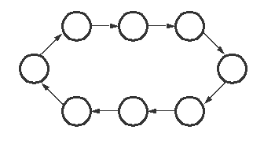
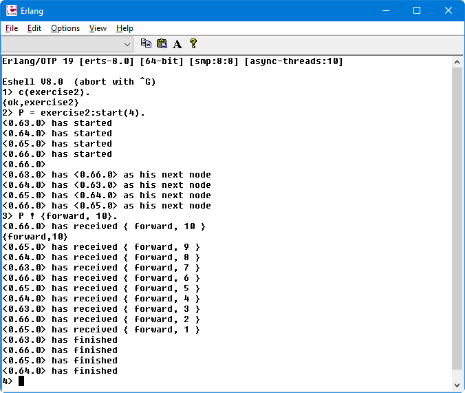

## Interaction between processes, Concurrency
(exercise taken from [Erlang Programming Exercices](http://erlang.org/course/exercises.html))

2) Write a function which starts N processes in a ring, and sends a message M times around all the processes in the ring. After the messages have been sent the processes should terminate gracefully.

## The shell result:

