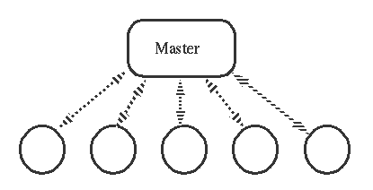
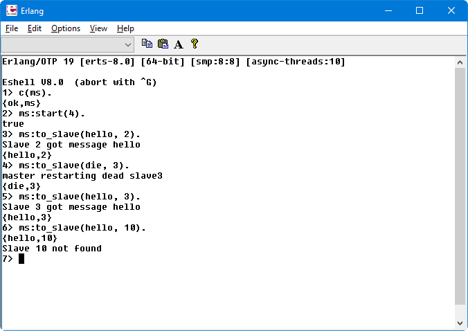

## Master and Slaves, error handling
(exercise taken from [Erlang Programming Exercices](http://erlang.org/course/exercises.html))

Write a module **ms** with the following interface:

**start(N)** - Start the master and tell it to start **N** slave processes. Register the master as the registered process **master**.

**to_slave(Message, N)** - Send a message to the master and tell it to relay the message to slave **N**. The slave should exit (and be restarted by the master) if the message is **die**.

The master should detect the fact that a slave processe died, restart it and print a message that it has done so.

The slave should **print** all messages it recieves except the message **die**.

## The shell result:

