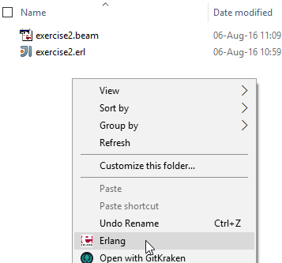
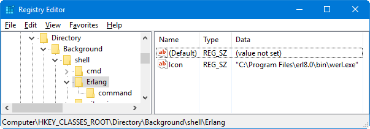
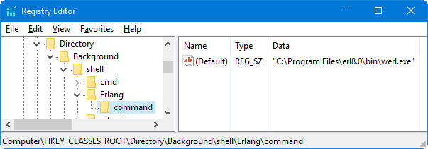

# Fábio's Erlang scrapbook

## Make, remake, erlang.mk, whoa!

It really has not been easy this learning curve. Everywhere I look there is more and more to learn, and I just realize how little (or nothing) I actually know. That is good, but it takes a toll on you.

I have been trying to create a simple example application. An HTTP REST api to minify URLs. The goal is to [learn](http://learnyousomeerlang.com/mnesia) & use [mnesia](http://erlang.org/doc/apps/mnesia/users_guide.html), supervision, a way to create REST APIs in Erlang ([cowboy?](https://github.com/ninenines/cowboy)) and experience a little more with actually creating an [Erlang application](http://erlang.org/doc/man/application.html).

This has not been an easy journey, but having watched [Erlang in practice](https://pragprog.com/screencast/v-kserl/erlang-in-practice) has really helped me leap forward. I only wish there were more screencasts like those.

I am using this blog post as a reminder to myself of all the steps necessary to start an Erlang project from scratch (side note: as a professional C# developer I have a whole new appreciation for Visual Studio!).

(my development environment is Windows 10)
* If not installed, you will need to install [MSYS2](https://sourceforge.net/projects/msys2/) and follow the steps in [erlang.mk - Installing on Windows](https://erlang.mk/guide/installation.html#_on_windows); 
* Follow the steps in  [erlang.mk - Getting started](https://erlang.mk/guide/getting_started.html);
* Using cowboy? Follow the stuff in [here](http://ninenines.eu/docs/en/cowboy/2.0/guide/getting_started/);

Fábio Beirão - 16/Aug/2016

---
---

## My first entry

A while ago I started looking into [Erlang](https://www.erlang.org/).

My mind was blown and still is, every day.

I am making an effort to learn Erlang. Not just the syntax, but the whole mindset that comes from designing software for the real (concurrent) world.

As a hardcore .NET C# developer, I am aware that this transition won't be the easiest. Yet, I firmly believe I will reap the benefits :)

This repo will work as my public scrapbook, so I can share my progress and keep track of some tricks.

**ProTip:**
Do you want to add an entry to your context menu that will open the Erlang shell in the current directory? 



Easy :) open **regedit**, navigate to **HKEY_CLASSES_ROOT\Directory\Background\shell** and add the following keys:

```
Erlang\Icon (REG_SZ) = "C:\Program Files\erl8.0\bin\werl.exe"
Erlang\command\(Default) (REG_SZ) = "C:\Program Files\erl8.0\bin\werl.exe"
```

It should look something like this:




Fábio Beirão - 06/Aug/2016

---
---